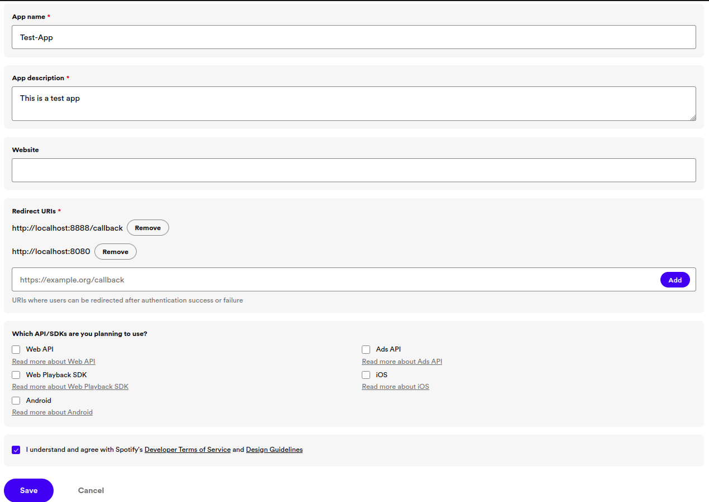

# Final Project Documentation

## ESP(otify)32: ESP32-Based Spotify Playback Controller

### Disclaimer
If you want to make your own controller, you need to purchase Spotify Premium in order to access Spotify’s APIs.

### Devices Used
- 
- 

## Make a Spotify App
1. Go to [Spotify Developer](https://developer.spotify.com)
2. Log in to your account
3. Open the dashboard
4. Click on the “Create App” button
5. Fill in the form
   
6. After you create the app, click on the app and then click on “Settings”
7. Here you can find your Client URL and Client Secret

## Wire Your Display with ESP32
Wire your ESP32 and your TFT LCD display with ILI9341 driver as written below:
- **Display**	→ **ESP32**
- `VCC` 		    → `3V3`
- `GND` 		    → `GND`
- `CS`		    → `15`
- `RESET` 	    → `4`
- `DC` 		    → `2`
- `MOSI` 		    → `23`
- `SCK` 		    → `18`
- `LED` 		    → `3V3`
- `TCLK` 		    → wire to display’s `SCK`
- `TCS`		    → `21`
- `TDIN` 		    → wire to display’s `MOSI`
- `TDOUT` 	    → `19`

## Install Necessary Libraries
1. Open Arduino IDE
2. Go to Library Manager
3. Search for “lvgl”
4. Click on the dropdown, select the 8.3.6 version
5. Search for “TFT_eSPI”
6. Install the library

## Make The GUI (Optional)
If you want to use the already-built GUI, skip this step.

1. Search for “SquareLine Studio” software on your browser
2. Follow the installation steps
3. Add images and set their positions according to your preferences
4. Click on File > Project Settings
5. Adjust the export paths
6. On the “LVGL Include Path”, write `lvgl.h`
7. After you’re done designing, export the project
8. Navigate to your working directory
9. You should see `.h` and `.c` files in your working directory
10. Copy these files into the working directory of your Arduino file (`*.ino`) (For Linux: `~/Arduino/project_name`)

## Get The Spotify Authorization Code
1. Copy the Client URL and Client Secret from the Dashboard
2. Open your browser
3. On the search bar, type:
`https://accounts.spotify.com/authorize?client_id=CLIENT_URL&response_type=code&redirect_uri=REDIRECT_URI&scope=user-read-playback-state%20user-modify-playback-state`
4. You will be redirected to the redirect URI
5. Look at your search bar; you will see the authorization code
6. Copy the authorization code (the part after `code=`). For example:
`http://localhost:8888/callback?code=YOUR_AUTHORIZATION_CODE`

## Get The Spotify Access Token and Refresh Token
1. Open Postman
2. Make a new HTTP request
3. Select the “POST” method
4. Fill the URL with `https://accounts.spotify.com/api/token`
5. Click the “Authorization” tab
6. Set the “Auth Type” to “Basic Auth”
7. Fill the “Username” field with your Client ID
8. Fill the “Password” field with your Client Secret
9. Click the “Body” tab
10. Select “x-www-form-urlencoded”
11. Insert these key-value pairs:
 - grant_type: authorization_code
 - code: YOUR_AUTHORIZATION_CODE
 - redirect_uri: YOUR_REDIRECT_URL
12. Click “Send”
13. You will get a response in JSON format
14. Copy the values of “access_token” and “refresh_token”

## Setting Up and Run The Program
1. Adjust the `lv_conf_template.h` file inside the `lvgl` library directory. For further information, read [this website](https://docs.lvgl.io/master/get-started/quick-overview.html#add-lvgl-into-your-project).
2. Modify the SSID and password of the WiFi in the code
3. Modify the Spotify Client URL and Client Secret in the code
4. Upload the program to your ESP32
5. When the upload process is finished, unplug the cable connecting your computer with your ESP32
6. Open the serial monitor in Arduino IDE (Ctrl + Shift + M)
7. Plug in the cable
8. In the serial monitor, you should see the ESP32 trying to connect to the WiFi
9. After connecting successfully, it will prompt you to insert the Access Token
10. After that, it will prompt you to insert the Refresh Token
11. If the process is successful, you will see a token in the serial monitor
12. The display should now show the UI instead of a white screen
13. Open your Spotify app on mobile, desktop, or web
14. Play a song
15. Try the skip-forward button on the display
16. If the process is successful, you will see something like this:
 ```
 Access token is valid.
 Skipped to next track
 ```

